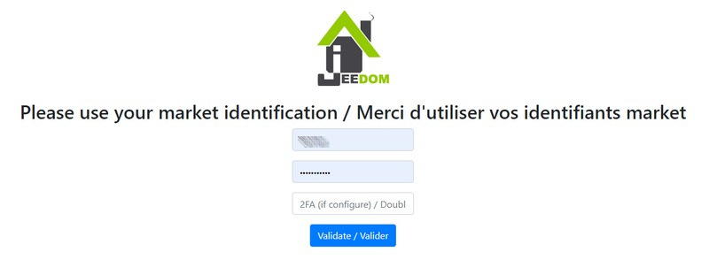
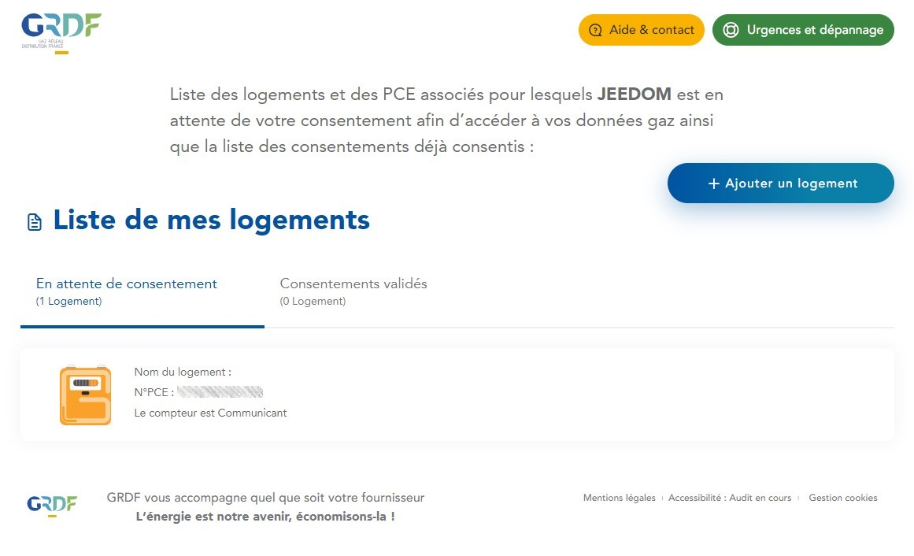
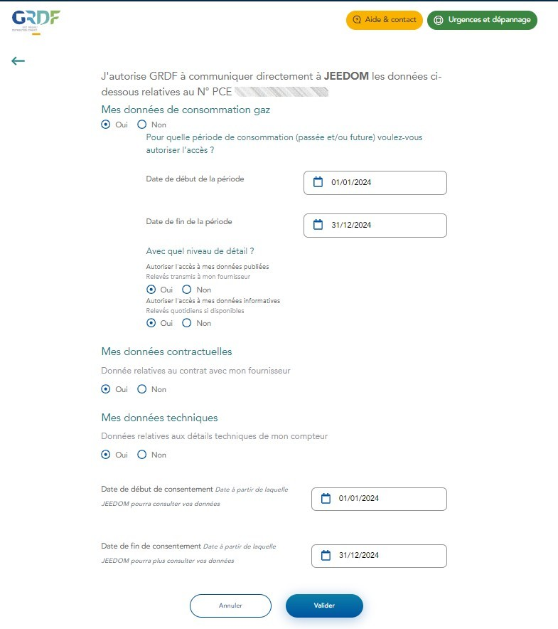

# Complemento GRDF

Complemento que permite la recuperación de datos de medidores de gas en comunicación _(Gazpar por ejemplo)_ vía [de una cuenta de cliente **GRDF**](https://login.monespace.grdf.fr/mire/connexion){:objetivo="\_en blanco"}.

Este complemento puede proporcionar acceso a lecturas de consumo de gas, así como a lecturas de inyección, si corresponde _(solo medidores profesionales)_. Él utiliza **la API oficial de GRDF ADICT**.

Dependiendo del tipo de medidor se pueden recuperar 2 tipos de datos :

- **Datos publicados** son proporcionados por todos los medidores. Se trata de datos transmitidos al proveedor para su utilización en la facturación. Estos datos se pueden consultar hasta hace un máximo de 5 años.
- **Datos informativos** hacer referencia a los datos diarios transmitidos por los medidores y publicar los datos mensuales para la facturación _(1M/MM)_. Estos datos se pueden consultar hasta hace 3 años como máximo.

Aún dependiendo del tipo de medidor, los datos disponibles no son los mismos, como tampoco lo es su frecuencia de disponibilidad.

|          **Tipo de medidor**          | Datos publicados                                     | Datos informativos                                   | Frecuencia de alivio                                                                                                                                                | Frecuencia de llamada                                                       |
| :-----------------------------------: | ---------------------------------------------------- | ---------------------------------------------------- | ------------------------------------------------------------------------------------------------------------------------------------------------------------------- | --------------------------------------------------------------------------- |
|        **6M** _(particuliers)_        | Datos semestrales                                    |                                                      | Cada 6 meses desde D+2 hasta D+3 después de la entrega                                                                                                              | 1 a 2 veces al mes                                                          |
|        **1M** _(particuliers)_        | Datos mensuales mes M-1                              | Datos diarios : - estimado - últimos meses M-1 | Cada mes desde D+2 hasta D+3 después de la fecha de publicación _(información publicada y definitiva)_ Todos los días del D+1 al D+3 _(información estimada)_    | 1 a 2 veces al mes _(publicado)_ 1 vez por día _(informatives)_          |
|      **M.M.** _(professionnels)_      | Datos mensuales mes M-1                              | Datos diarios mes M-1                                | Cada mes entre D+2 después de la fecha de publicación y los 7.º Juegos Olímpicos del mes M _(publicado)_ Cada mes entre el 10 y el 20 del mes M _(informatives)_ | 1 a 14 veces por mes _(publicado)_ 1 a 11 veces por mes _(informatives)_ |
| **Ni una palabra** _(professionnels)_ | Datos diarios : - estimado - últimos meses M-1 |                                                      | Todos los días del D+1 al D+2 _(estimado publicado)_ Cada mes entre la 1.ª y 6.ª Olimpiada del mes M _(publicado definitivamente)_                               | 1 vez por día                                                               |

> **INFORMACIÓN**
>
> Los contadores **6M** son complementos compatibles, sin embargo, normalmente todos han sido reemplazados por contadores **1M** a finales de 2023.

# Configuration

Como cualquier complemento de Jeedom, el complemento **GRDF** debe activarse después de la instalación.

## Configuración del complemento

> **INFORMACIÓN**
>
> No dude en **copiar el número de identificación del PCE** cuando aparece durante esta operación porque será útil durante el paso de configuración del equipo Jeedom.

Para comenzar, debes autorizar el intercambio de datos de GRDF con Jeedom haciendo clic en la imagen **Autorizar el acceso a la cuenta GRDF** desde la página de configuración del complemento :

Luego serás redirigido a esta página en la que deberás proporcionar información **sus identificadores en el mercado Jeedom** luego haga clic en el botón **Validar** :

**Inicia sesión en tu área de clientes de GRDF** luego seleccione un contador **esperando consentimiento** :

Seleccione sus consentimientos y luego haga clic en el botón **Validar** :

- **Mis datos de consumo de gas** : **Sí** _(obligatoire)_
  - **Fecha de inicio** : **1 de enero del año en curso** o 1 de enero hasta hace 4 años para consultar años anteriores en Jeedom.
  - **Fecha final** : Opcionalmente, la misma fecha de finalización del consentimiento, por ejemplo.
  - **Datos publicados** : **Sí** _(obligatoire)_
  - **Datos informativos** : **Sí** _(muy recomendado)_
- **Mis datos contractuales** : **Sí** _(facultatif)_
- **Mis datos tecnicos** : **Sí** _(obligatoire)_
- **Fecha de inicio del consentimiento** : **Fecha**
- **Fecha de finalización del consentimiento** : Elección.

Una vez validados sus consentimientos, tiene la posibilidad de **dar su consentimiento para otro PCE** O **volver a la página de Jeedom** confirmando el final de la operación :

> **IMPORTANTE**
>
> Si no puede acceder a una de estas páginas, desactive el bloqueador de anuncios del navegador.

## Configuración del equipo

Para acceder a los diferentes equipos **GRDF**, tienes que ir al menú **Complementos → Energía → GRDF**.

> **INFORMACIÓN**
>
> El botón **Agregar** le permite agregar un nuevo contador.

Una vez validadas las autorizaciones de acceso, solo queda proporcionar **el número de identificación del PCE** preocupado _(los espacios se eliminan automáticamente)_ luego guarde el equipo.

La opción **Guarde el coeficiente de conversión** permite observar la relación entre la energía realmente consumida _(kWh)_ y el volumen _(m3)_.

Medidores profesionales _(MM o DD)_ tener un campo de configuración adicional que le permite elegir el tipo de medición a tomar :

- **Consumo**
- **Inyección** _(Productores de Biometano)_
- **Los 2**

# Commandes

Los pedidos se crean automáticamente en función de la frecuencia de recopilación de datos _(día, mes, semestre)_ y su tipo _(definitivo o estimado)_.

El complemento se encarga de realizar cálculos mensuales y anuales cuando sea necesario, por lo que es recomendable ingresar la fecha de inicio de acceso a los datos de consumo de gas el 1 de enero durante la etapa de consentimiento.

Durante la primera copia de seguridad de los equipos activos y correctamente configurados, el complemento integrará automáticamente los históricos disponibles en el área de clientes de GRDF desde la fecha de inicio de acceso a los datos de consumo de gas. Es probable que este proceso dure mucho tiempo, puedes seguir su progreso desde el menú **Análisis → Registros** _(inicia sesión en `depuración`)_.

> **INFORMACIÓN**
>
> Los datos se transmiten en kilovatios-hora (`kWh`) con una fecha de lectura de las 6 a. m. No están disponibles en tiempo real, pero se registran en su fecha de vigencia en Jeedom.
